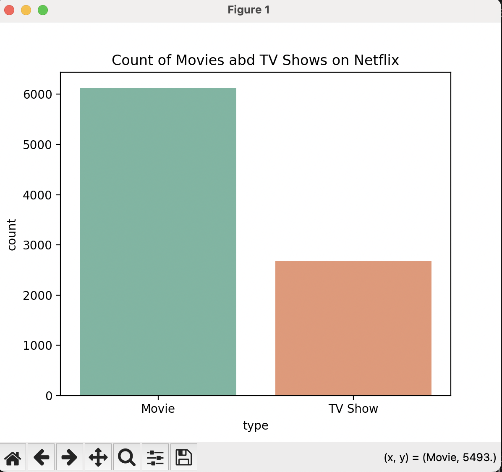
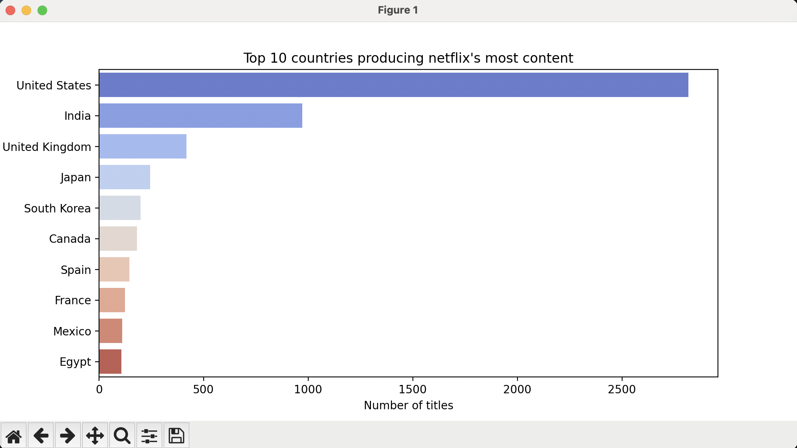
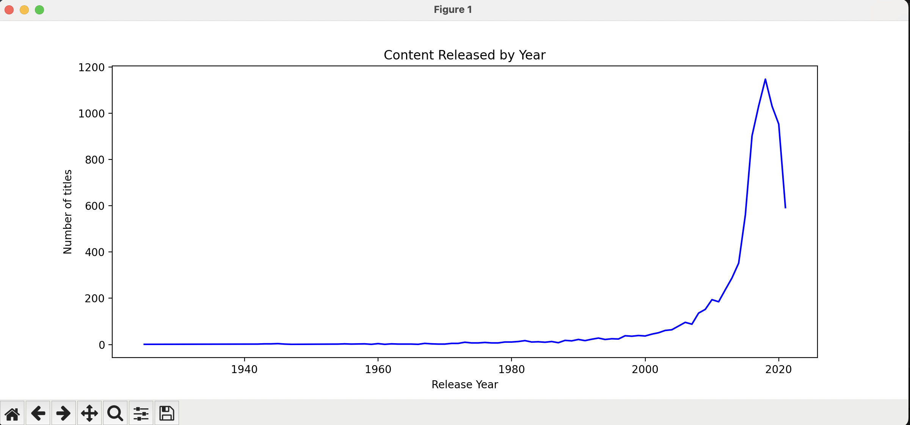
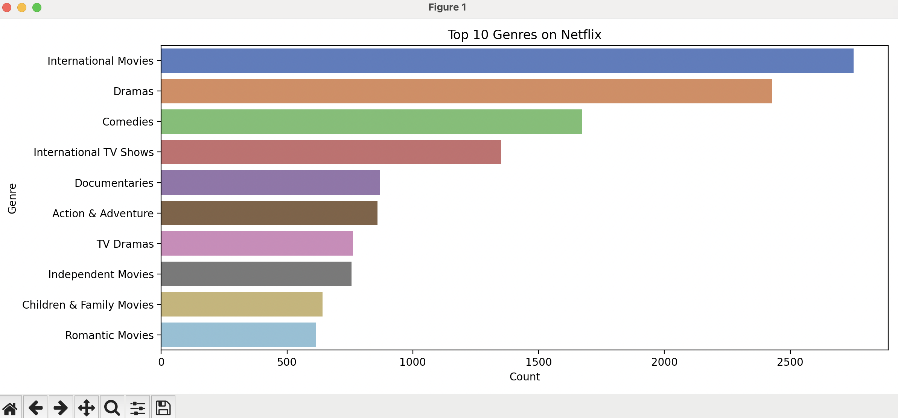
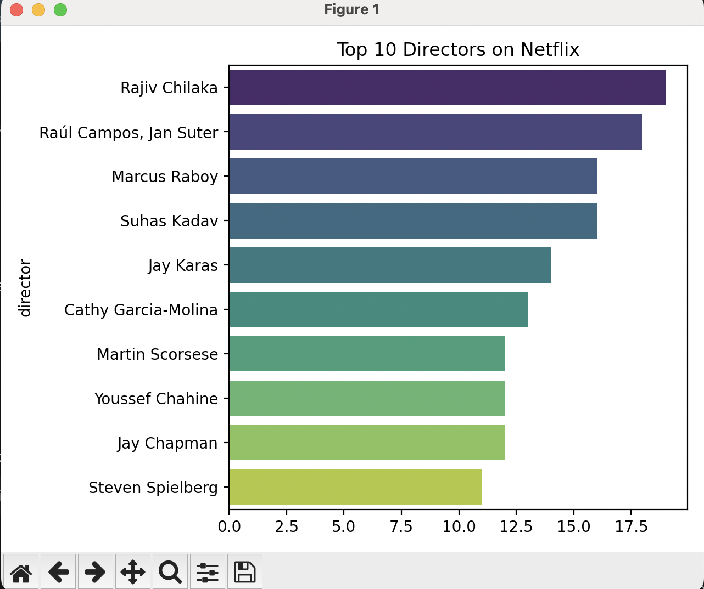
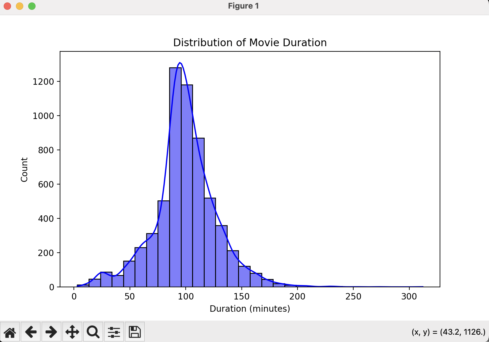

# 🎬 Netflix Movies and TV Shows — Exploratory Data Analysis (EDA)

## Goal  
Perform **exploratory data analysis (EDA)** on Netflix's catalog to uncover trends in content type, genre, release year, ratings, and country distribution.

---

## Dataset Information  
- **Source:** [Kaggle – Netflix Movies and TV Shows Dataset](https://www.kaggle.com/datasets/shivamb/netflix-shows)  
- **Dataset Name:** Netflix Movies and TV Shows Dataset  
- **Columns:**  
  - `show_id`  
  - `type` (Movie / TV Show)  
  - `title`  
  - `director`  
  - `cast`  
  - `country`  
  - `date_added`  
  - `release_year`  
  - `rating`  
  - `duration`  
  - `listed_in` (Genres)  
  - `description`

---

## Key Insights  
- ~70% of Netflix titles are Movies.  
- The U.S. dominates Netflix’s catalog, followed by India and the U.K.  
- Most releases peaked after 2015.  
- “Documentaries” and “International Movies” are among the most common genres.  
- Average movie duration is around **100 minutes**.

---

## Visualizations  

### Movies vs TV Shows  


### Top 10 Countries Producing Content  


### Content Release Over the Years  


### Top 10 Genres  


### Top 10 Directors  


### Movie Duration Distribution  


---

## Steps to Run the Project  

1. **Make sure you have Python installed.**  
2. Create a virtual environment:  
   ```bash
   python -m venv venv
3. Activate virtual env
    ```bash
    source venv/bin/activate
4. Install Dependencies
    ```bash
    pip install pandas
    pip install numpy
    pip install seaborn
    pip install matplotlib
5. Run the dasboard
    ```bash
    streamlit run netflix_dashboard.py
6. Open in the browser - http://localhost:8501/
